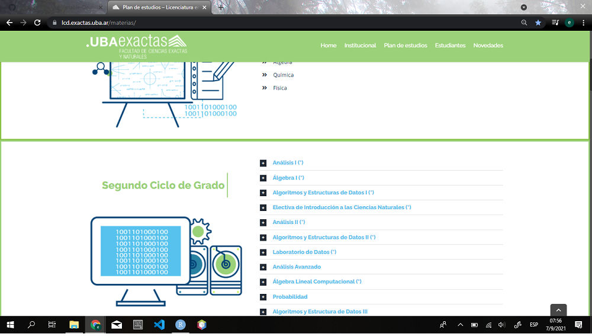

# Datos No Estructurados

## No todo viene siempre en un CSV

En esta parte de la materia vamos a explorar otras fuentes de datos que que no son el tradicional archivo CSV. En rigor, se usa el término no estructurado para referirse a cualquier fuente de datos que no se encuentre en formato de tabla. Como suele pasar con categorias que se define por la negativa contiene cosas de las más variadas:

-   Una colección de archivos de texto.
-   Código HTML o XML
-   Objetos anidados (formato JSON)
-   Mediciones de sensores
-   Datos geoespaciales
-   Imágenes, video, audio...

Por supesto que esta lista es enorme y escapa a los contenidos de la materia verlos todos. Es más, muchos de esos tipos de datos definen campos en sí mismos con técnicas específicas y propias de cada tipo. Por ejemplo las imágenes y videos son objeto de estudio del campo de la *visión computacional*. Vamos a empezar nuestro recorrido alejandonos un poco del formato super estructurado del CSV, pero no nos vamos a alejar tanto. Si permitimos formas de vinculo un poco más flexibles que la estructura tabular nos encontramos con formatos como HTML, XML y JSON. A veces a este tipo de datos se los llama semi-estructurados.

## Datos semi-estructurados: XML, HTML, JSON

Este tipo de formatos suelen ser el resultado de peticiones *http* hechas a través de internet. No es la idea de este curso estudiar el protocolo http y todas sus posibilidades, basta con saber que a partir de una URL (Uniform Resource Locator) podemos acceder a ciertos recursos específicos. Por ejemplo, si hacemos un pedido a la URL `https://lcd.exactas.uba.ar/materias/` recibimos como respuesta una serie de caracteres que conforman un archivo HTML. Por supuesto que para mostrar una página web vamos a necesitar un montón de archivos adicionales que iran llegando mediante **otros** pedidos http dependiendo de cual sea el código. Luego de ese proceso iterativo términamos con algo como esto:



Nosotros no vamos a hacer uso de ese proceso tan complejo lo único que nos importa es que dada una *URL* podemos recibir una serie de caracteres como respuesta.

Resumido asi no más: *URL* ---\> *caracteres (texto)*

Para poder hacer estas peticiones http vamos a necesitar algunas funciones que no son parte de rbase asi que vamos a ir introduciendo algunos paquetes a medida que lo necesitemos. En primera instancia vamos a usar el paquete *httr*. Si no lo tienen, pueden instalarlo usando `install.packages('httr')`.

```{r}
require(httr) # Activamos el paquete
```

No se preocupen mucho por entender este paquete en sí porque lo vamos a usar solo para entender la mecánica básica de los pedidos HTTP pero después vamos a usar paquetes más específicos que nos van a simplificar la vida. Veamos que pasa si hacemos un pedido al sitio de exactas usando la función `GET`:

```{r}
res = GET("https://lcd.exactas.uba.ar/materias/") # hacemos el pedido http 
summary(res) # Vemos un resumen de la salida del llamado anterior
```

Vemos que nos devuelve un objeto con muchas propiedades pero lo que nos va a interesar es esencialmente el contenido de la respuesta que esta en `res$content`

```{r}
res$content[1:1000]
```

Oops! Son los bytes pelados! Para convertir esos bytes pelados en caracteres podemos usar `rawToChar`

```{r}
rawToChar(res$content[1:1000])
```

Un poco más claro pero no mucho. Para pode extraer información de un archivo HTML vamos a tener que "parsearlo" (anglicismo del verbo *to parse*), es decir identificar sus componentes y separarlo en partes. Por suerte las tareas de parseo mas comunes ya están preprogramadas y hay paquetes que nos van a simplificar un poco la vida. Acá es donde entra rvest (juego de palabras entre R y *harvest*, que quiere decir recolectar o cosechar en inglés). Recuerden instalarlo si no lo tienen con `install.packages("rvest")` y acceder a la documentación con: `?rvest`

```{r}
require(rvest) # Cargamos el paquete
```

y vamos a usarlo para extaer información de la pagina de materias de la carrera que vimos recien. Para eso usamos la función `read_html` que nos permite leer directamente una URL

```{r}
pag_materias = read_html("https://lcd.exactas.uba.ar/materias/")
```

y ahora vamos a "parsear" los datos que estan en la tabla de correlatividades de esa pagina 

Para eso, tenemos que seleccionar el elemento HTML que contiene la tabla. Acá es donde el "parseo" se convierte un poco en un arte, podemos usar la consola de nuestro navegador para estudiar el código html y ver que el elemento que contiene lo que nos interesa pertenece a una clase que se llama *table*. (Aclaración sobre cómo se hace esto en el video)


```{r}
pag_materias
```

Podemos elegir los elementos que pertenecen a la clase *table* de la siguiente manera:

```{r}
elemento_tabla  = html_element(pag_materias, '.table')
toString(elemento_tabla) # Podemos chusmear el pedacito de codigo HTML que seleccionamos
```

y luego convertir el código html que corresponde a ese elemento en una tabla de R

```{r}
correlativas = html_table(elemento_tabla)
correlativas
```

Fijense que en este caso el parseo automatico de tables que hizo la funcion `html_table` no capturo correctamente la primera fila como titulos o *headers*. Para corregir esto podemos hacer:

```{r}
nombres = correlativas[1,]
colnames(correlativas) = nombres
correlativas = correlativas[-1,] # Esto quiere decir todas las filas EXCEPTO la primera
correlativas
```

Esto es algo que, en general, va a haber que hacer: limpiar, emprolijar, uniformizar campos, trabajar con datos incompletos. En este caso fue bastante fácil porque el código html escondía un formato tabular pero podría ser mucho más complejo. Imagínense, por ejemplo, obtener todas las características de los productos listados como 'guitarra' en un comercio virtual, cuyos resultados pueden estar separados en varias paginas y contener información muy distinta entre guitarra y guitarra, puede haber errores de etiquetado, etc.

## Buenas practias de scrapeo. No todo lo que se puede se debe.

Al *scrapear* estamos haciendo uso de recursos que generan o almacenan terceras personas y que pueden no querer compartirlo. Es por eso que es importante leer bien los términos y condiciones de uso del sitio del cual queremos extraer información. Por ejemplo Amazon prohibe este tipo de prácticas expresamente: 

En los sitios suele haber un archivo en la URL base /robots.txt (por ejemplo <https://exactas.uba.ar/robots.txt>) donde se explicita que familias de URLs se pueden *scrapear* y cuáles no. Hay un [paquete de R para chequear esto automáticamente](https://cran.r-project.org/web/packages/robotstxt/index.html).

## Espacio para practicar - Ejercicio

Extraigan la tabla de velocidad de distintos animales de <https://es.wikipedia.org/wiki/Velocidad_de_los_animales>.

```{r eval = FALSE}
  pag_wiki = read_html("https://es.wikipedia.org/wiki/Velocidad_de_los_animales")
  elem_tabla = html_element(pag_wiki, ".wikitable")
  velocidades = html_table(elem_tabla)
  velocidades

```

Van a notar que la columna interesante es muy sucia porque tiene rangos de velocidades (hay que tomar una decision y reemplazar por promedio, maxima o minima) y ademas tiene llamadas al pie de citas que dificultan la conversion a numeros. Para poder eliminar esta información vamos a ver en que tags html se encuentran almacenadas y los vamos a borrar del codigo de la página antes de extraer la tabla.


Vemos que las etiquetas que nos molestan son `<span>` y `<sup>`. Vamos a eliminarlas, para eso vamos a usar de la libreria *xml2*.

```{r}
require(xml2) # REcuerden instalarla con install.packages('xml2') si no la tienen
```

```{r eval = FALSE}

sups = html_elements(pag_wiki, xpath='//table//sup') # elegimos todos los elementos sup que esten dentro de un elemento table
spans = html_elements(pag_wiki, xpath='//table//span') # elegimos todos los elementos span que esten dentro de un elemento table
xml_remove(spans) # Los eliminamos
xml_remove(sups)
```

Ahora si vuelvan a intentar parsear la tabla

```{r eval = FALSE}
  velocidades = html_table(elem_tabla)
  velocidades
  
  #
  # (completar)
  #
  
```

Aún así necesitamos procesar un poco más la columna de velocidad. Tenemos que poder converirlas a un número. Para eso pueden resultarles útiles las siguientes lineas:

- vel_numero = strsplit(vel_str, '-|−') *# Divide al string donde haya - o − *
- vel_numero = gsub('[^0-9,]','', vel_numero) *# Reemplaza por nada todo lo que ***NO ***sea numero o ','*
- vel_numero = gsub(',','.', vel_numero) *# Reemplaza coma por punto para poder convertir con as.double()*

```{r eval = FALSE}

for (vel_str in ________){  ## Completar
 ## Completar
}

```

### Extra desafío

Esto es opcional **no lo vamos a resolver en clase**. En la tabla de velocidades de animales cada animal tiene un link a su página de wikipedia. El desafio es recorrer esos links y extaer de cada animal su clase Ej:


Y explorar si existe alguna relación entre las clases de animal y sus respectivas velocidades.

### Ejercicio

Carguen la tabla de superficies de paises de https://www.worldometers.info/geography/largest-countries-in-the-world/ 

```{r}
pag_paises = read_html("https://www.worldometers.info/geography/largest-countries-in-the-world/")
elem_tabla = html_element(pag_paises, ".table")
superficies = html_table(elem_tabla)
superficies
```

```{r}
superficies['area_km'] = as.numeric(gsub(',','', superficies$`Tot. Area (Km²)`))
```

```{r}
summary(superficies$area_km)
```

1. Conviertan las columnas que consideren apropiadas en datos numericos
1. ¿Cuál es el pais de mayor superficie?
1. ¿Cual es el pais con mayor superficie maritima?
1. ¿Cuál tiene la mayor relación sup. agua / sup. tierra?
1. Cuenten cuántos paises tiene áreas que empiezan con el número 1, cuántas con 2,3,4,5,6,7,8,9. Pista: usen la columna original en formato *char* y la funcion *substr*
1. Hagan un histograma ¿Hay algún patrón? Pista: https://es.wikipedia.org/wiki/Ley_de_Benford (para una versión más amena vean éste capítulo de serie https://www.imdb.com/title/tt12816822/ )

## Acceso programatico a datos (APIs)

Muchos sitios proveen acceso a su información o sus servicios de manera programática. Es decir que tienen URLs que en vez de estar pensadas para ser visitadas por un navegador están preparadas para integrarse como parte de otros procesos. Esto nos va simplificar la vida porque no vamos a tener que estar *parseando* código HTML que en realidad está pensado para ser renderizado y mostrado en un navegador. 

### ¿Qué es una api?

La sigla API corresponde a Application Programming Interface (interfaz de programación de una apliacación). Es decir que una API son las reglas para interactuar con un dado software. Podemos pensarlo como las especificaciones de una enchufe, con todos los requisitos que tenemos que cumplir para "engancharnos" a un sistema y usarlo. Es una especificación de los métodos, el tipo de datos que ingresan y el tipo de datos que regresan de un dado sistema. 
Si bien la idea de API es aplicable a cualquier software, se suele usar especialmente en el contexto de software que se expone através de internet. Algunas APIs estan pensadas para ser de uso público, otras son internas; algunos se pueden acceder sin ninguna forma de autorización, otras requieren metodos de autenticación; algunas son gratis otras se ofrecen como servicios pagos.

### ¿Cómo se accede a datos mediante una api?

Empecemos con una API muy sencilla, como puede ser la que expone el ministerio de cultura en esta URL: <https://www.cultura.gob.ar/api/v2.0/> Si ingresan en esta URL podemos ver que la API tiene los siguientes *endpoints* (un endpoint es una suburl dentro de la api para algún fin específico):

-   "usuarios": "<https://www.cultura.gob.ar/api/v2.0/usuarios/>"
-   "organismos": "<https://www.cultura.gob.ar/api/v2.0/organismos/>"
-   "programas": "<https://www.cultura.gob.ar/api/v2.0/programas/>"
-   "museos": "<https://www.cultura.gob.ar/api/v2.0/museos/>"
-   "institutos": "<https://www.cultura.gob.ar/api/v2.0/institutos/>"
-   "tramites": "<https://www.cultura.gob.ar/api/v2.0/tramites/>"
-   "convocatorias": "<https://www.cultura.gob.ar/api/v2.0/convocatorias/>"

Veamos que encontramos en el *endpoint* museos:

```{r}
res_museos = GET("https://www.cultura.gob.ar/api/v2.0/museos/")
rawToChar(res_museos$content[1:2000])
```

Si lo formateamos un poco mas prolijo vemos una parte de la respuesta que llegó: 

Vemos que **no es un HTML**. Es otro formato de datos y es EL formato mas estandar en uso en la interacción con APIs. Es un formato que se llama [JSON](https://es.wikipedia.org/wiki/JSON).

### El formato JSON

El formato JSON (JavaScript Object Notation) es el caballito de batalla de los datos semi-estructurados asi como el CSV es el caballito de batalla de los datos estructurados. El formato CSV es una especificación sobre como almacenar datos tabulares en un archivo de texto (y define qué caracteres se pueden usar y en qué orden - [aca la definicion formal técnica del standard en ingles](https://datatracker.ietf.org/doc/html/rfc4180)) y el formato JSON también define cómo codificar en texto cierto tipo de objetos anidados ([aca la definicion formal técnica del standard en ingles](https://datatracker.ietf.org/doc/html/rfc7159) ). NO ES IMPORTANTE que lean los estándares, quedan solo como referencia por si a algune le interesan.

Al igual que pasa con el HTML para poder usar la información de un JSON vamos a tener que *parsearlo*. Por suerte como es un formato super estándar ya hay paquetes preparados para hacerlo. En este caso, el paquete que vamos a usar se llama `jsonlite`. Recuerden instalarlo si no lo tienen con `install.packages("jsonlite")`

```{r}
require(jsonlite)  # lo cargamos
```

```{r}
museos = fromJSON("https://www.cultura.gob.ar/api/v2.0/museos/") # Llamamos al endpoint ahora ya "parseando" el JSON
summary(museos)
```

```{r}
museos$results
```

Vemos que el texto se convirtio en un objeto de R con los mismos campos que podiamos leer en el formato de llaves y comillas


## Ejemplos

Vamos a ver algunos ejemplos de otras APIs para poner estas ideas en práctica. En cada ejemplo se plantean una serie de ejercicios

### API de datos de recetas de tragos

Como primer ejemplo de una api sencilla vamos a ver esta https://www.thecocktaildb.com/api.php. Ahi podemos ver sus *endpoints*. Y vamos a ver algo interesante que no habiamos visto en la API de cultura que es que los endpoints son métodos que pueden recibir *parámetros*. Por ejemplo vemos que el endpoint www.thecocktaildb.com/api/json/v1/1/filter.php?i=**Gin** nos permite hacer una búsqueda por ingrediente (el ingrediente **Gin** es el valor asignado al parámetro **i**). Veamos:
```{r}
tragos = fromJSON("http://www.thecocktaildb.com/api/json/v1/1/filter.php?i=Gin")
tragos
```
Y si ahora queremos tragos que lleven naranja simplemente reemplazamos el ingrediente:

```{r}
tragos = fromJSON("http://www.thecocktaildb.com/api/json/v1/1/filter.php?i=Orange")
tragos
```

Si queremos saber que ingredientes hay disponibles podemos usar el *endpoint* http://www.thecocktaildb.com/api/json/v1/1/list.php?i=list

```{r}
ingredientes = fromJSON("http://www.thecocktaildb.com/api/json/v1/1/list.php?i=list")
ingredientes
```

```{r}
tragos = c()
for (i in 1:10){
  print(i)
  azar = fromJSON("http://www.thecocktaildb.com/api/json/v1/1/random.php")
  tragos = c(tragos, azar)
}
```
```{r}
datos_tragos = c()
for (t in tragos){
  print(t$idDrink)
  datos_trago = fromJSON(paste("http://www.thecocktaildb.com/api/json/v1/1/lookup.php?i=", t$idDrink))
  datos_tragos = c(datos_tragos, datos_trago)
}

```
```{r}
cant_ingredientes = c()
for (d in datos_tragos){
  print(d$idDrink)
  cant = sum(!is.na(d[1,18:32]))
  cant_ingredientes = c(cant_ingredientes, cant)
}
```
```{r}
cant_ingredientes
mean(cant_ingredientes)
```

#### Ejercicios

1. Elijan 10 tragos al azar (busquen en la [documentacion](https://www.thecocktaildb.com/api.php) hay un *endpoint* para traer de 1 trago al azar -el de 10 es pago-) y calculen la cantidad de ingredientes promedio por trago. Recuerden ese número, lo vamos a compartir al final de la clase. 
1. Elijan un ingrediente del dataframe de ingredientes y busquen tragos con ese ingredientes: ¿Cuántos son?
1. ¿Cuál es la distribución de tipos de vaso en los tragos que usan Gin?
1. ¿Se parece a la de tragos que usan Champagne?
1. Tomen las instrucciones para hacer el trago de 10 tragos distintos en los distintos idiomas y cuenten la frecuencia de cada letra (Pista: table(strsplit(texto_instrucciones, '')))
1. Hagan uno o más graficos de barras ¿Se parecen las distribuciones?
1. ¿Cuál es la letra que mejor distingue el alemán del italiano? 


### API de datos del Banco mundial

En esta parte de la clase vamos a trabajar con otra api que tiene datos económicos y sociales de distintos paises. Es la api del banco mundial. Es una API bastante compleja, acá pueden encontrar la documentación para usarla: https://datahelpdesk.worldbank.org/knowledgebase/topics/125589-developer-information

Dada la cantidad ENORME de indicadores que tiene el banco mundial, vamos a usar este sitio que nos permite explorarlos visualmente y luego elegir con cuales vamos a querer trabajar https://datos.bancomundial.org/ Ahi pueden buscar por ejemplo PBI (hay varias variantes puede ser por ejemplo -PIB per cápita, PPA ($ a precios internacionales actuales)- ). Si entran van a ver que aparece un grafico para el mundo y hay un boton de detalles. Si lo *clickean* van a poder encontrar un id para el indicador. En este caso `NY.GDP.PCAP.PP.CD`. Ese es el id que vamos necesitar para hacer la consulta:


```{r}
data = fromJSON("https://api.worldbank.org/v2/es/country/all/indicator/NY.GDP.PCAP.PP.CD?format=json")
data
```
Vemos que la respuesta incluye dos partes, unos [metadatos](https://es.wikipedia.org/wiki/Metadatos) que nos indican información general sobre el recurso que acabamos de pedir. Por ejemplo que la cantidad total de registros del dataset es 16226 y que se actualizaron por última vez el 30 de Julio de 2021. También que solo recibimos en este pedido 50 datos. En este caso los datos están paginados en 325 páginas de 50 elementos cada una. Hay un parámetro de la api que nos permite traer todo de una:

si agregamos &per_page=20000 cambiamos el maximo por página y traemos todos los datos en una sola consulta

```{r}
data = fromJSON("https://api.worldbank.org/v2/es/country/all/indicator/NY.GDP.PCAP.PP.CD?format=json&per_page=20000")
pbi = data[[2]]
```
y podemos graficar el pbi para Argentina y Brasil en función del tiempo
```{r}
pbi
```


```{r}
valor_ar = pbi[pbi$countryiso3code == 'ARG', 'value']
anio_ar = pbi[pbi$countryiso3code == 'ARG', 'date']
plot(anio_ar, valor_ar, type='l', col='red', xlab = 'Año', ylab='PBI Per. Cap. PPP')

valor_br = pbi[pbi$countryiso3code == 'BRA', 'value']
anio_br = pbi[pbi$countryiso3code == 'BRA', 'date']
lines(anio_br, valor_br, col='blue')
legend(1960, 15000, legend=c("Argentina", "Brasil"),
       col=c("red", "blue"), lty=c(1, 1), cex=0.8)
```

#### Ejercicios

Tengan presente la documentacion para hacer los ejercicios https://datahelpdesk.worldbank.org/knowledgebase/articles/898581-api-basic-call-structures 

1. Elijan otro indicador usando el explorador del banco mundial y traigan los datos via API
1. Prueben traer datos solo para un par de paises y dentro de un rango particular de años (consulten la documentacion para ver que parte de la URL modificar)
1. Hagan un grafico de barras con los 10 paises con mayor esperanza de vida (considerando solo paises de al menos 10M de habitantes) en los 80' y hoy. ¿Cambio el top 10?
1. Dentro de los paises de mas de 10M de habitantes ¿Cuáles aumentaron más su esperanza de vida en los últimos 40 años?


#### APIs grandes suelen tener paquetes

Las APIs grandes o muy usadas suelen tener paquetes instalables para los lenguajes más populares de manera tal que no hace falta estar generando a mano las URLs y consultas HTTP. Muchas veces esos paquetes son construidos por la propia comunidad de cada lenguaje y no necesariamente por quién creo la API. Ese es el caso de la api del banco mundial que tiene disponible el paquete WDI para R.  Para instalarlo `install.packages('WDI')` . Pueden ver la documentación en https://github.com/vincentarelbundock/WDI 

1. Prueben usar directamente el paquete en lugar de usar la URL para repetir alguno de los puntos del ejercicio anterior

### API de datos georreferenciados de argentina.gob.ar

Finalmente vamos a tabajar con una API un poco distinta para entender que no solo sirven para consultar datos sino que podemos usarlas como servicios e incluirlas como parte de nuestras rutinas de análisis. Como ejemplo vamos a usar esta API de georreferenciación nacional https://datosgobar.github.io/georef-ar-api/

Esta api tiene distintos *endpoints* para cada caso de uso, por ejemplo podemos saber a que muncipio, departamento y provincia pertenecen ciertas coordenadas:


```{r}
fromJSON("https://apis.datos.gob.ar/georef/api/ubicacion?lat=-27.2741&lon=-66.7529")
```
O cual es la ubicación de una dada dirección. Por ejemplo, ¿Dónde queda Avenida Rivadavia 3000?

```{r}
res = fromJSON("https://apis.datos.gob.ar/georef/api/direcciones?direccion=av.%20rivadavia%203000")
res$direcciones$nomenclatura
```
Vemos que hay varias opciones compatibles con esa dirección y recibimos mucha información adicional sobre esas direcciones, por ejemplo sus coordenadas:
```{r}
res$direcciones$ubicacion
```
Si agregamos algo de informacion extra, como la provincia o distrito sobre la que estamos haciendo la busqueda (por ejemplo CABA) podemos conseguir una respuesta única
```{r}
x = fromJSON("https://apis.datos.gob.ar/georef/api/direcciones?direccion=av.%20rivadavia%203000&provincia=caba")
x$direcciones$nomenclatura
```
Habrán notado que estamos introduciendo las direcciones de una manera un poco extraña en la url, esto es porque las URLs no pueden contener cieros caracteres (como espacios) y entonces hay que convertirlos a otras secuencias de caracteres permitidos. Por suerte hay una función que ya lo hace que podemos usar:

```{r}
URLencode("Av. de mayo 1658")
```
```{r}
x = fromJSON(URLencode("https://apis.datos.gob.ar/georef/api/direcciones?direccion=av. del libertador 1400&provincia=caba"))
print(x$direcciones$nomenclatura)
print(x$direcciones$ubicacion)
```

#### Ejercicios

Escriban un pequeño script que para cada museo de la API del ministerio de cultura obtenga sus coordenadas usando la API de georreferenciación. Partan el problema en pasos:

1. Consigan la dirección de un museo
1. Extraigan las coordenadas con la api de georref para ese museo
1. Pongan esos dos códigos juntos y fíjense que ande
1. Construyan un *for loop* que recorra todos los museos y ejecute el código que armaron en el punto anterior
1. Elijan un trago con o sin alcohol de la API de tragos y brinden por su ejercicio


```{r}
# 

```

# Session Info
Referencia de la sesion con la que fue corrido este notebook
```{r}
sessionInfo()
```