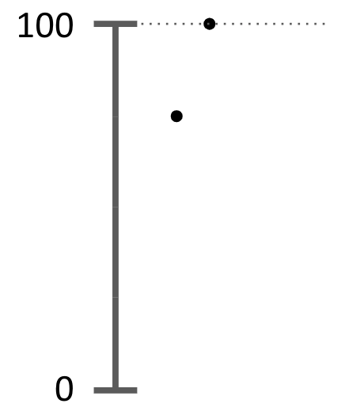
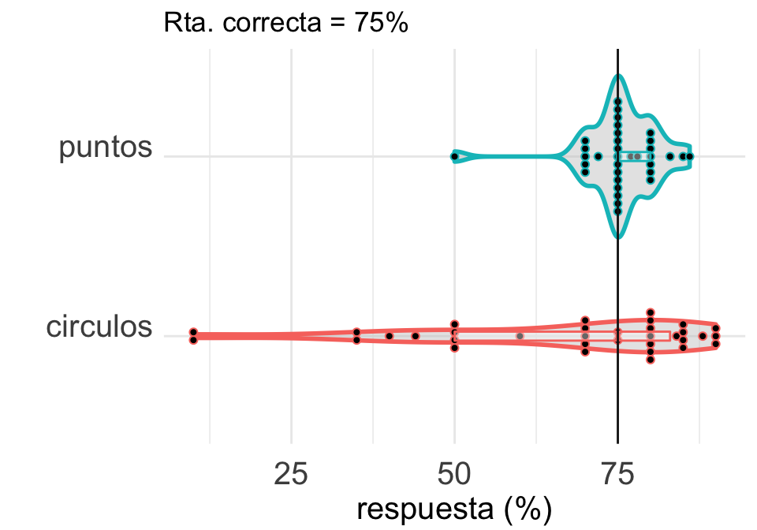
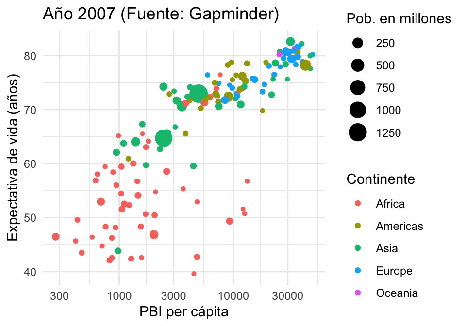
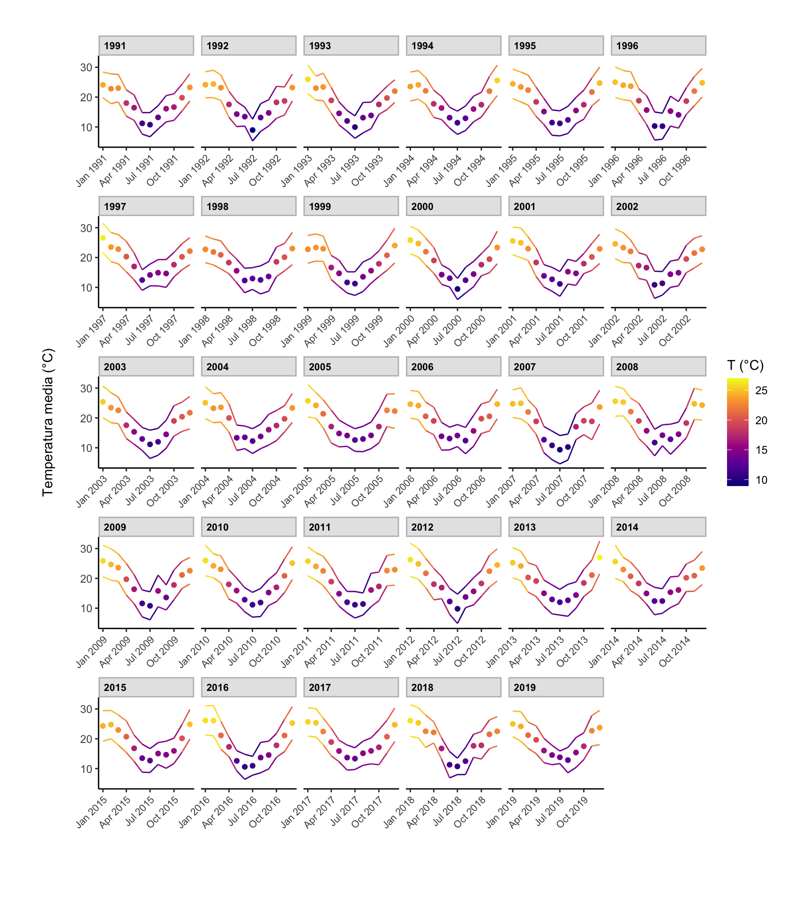

```{r setup, include=FALSE}
knitr::opts_chunk$set(echo = TRUE)
```

### Descripción
En estos ejercicios tienen que integrar `dplyr` y `ggplot2`. Además, van a aparecer otros
paquetes de `tidyverse` que los verán anunciados oportunamente o el paquete para trabajar
con fechas `lubridate`. 

```{r message=FALSE}
require(tidyverse)
```

### Ejercicios

##### 1 Datos del experimento de visualización

En la [clase de visualización](https://youtu.be/Pc3vxs2ZPAE?t=870) participaron de un 
[experimento](https://forms.gle/B5FpDJGTp1i8d4E87). Una de las preguntas era cuál es
el área del círculo pequeño respecto del más grande en esta figura:

{width=20% height=20%}

La respuesta correcta era 75%. La otra pregunta relevante era a qué altura está el punto de 
abajo, entre 0 y 100, en la siguiente figura:

{width=20% height=20%}


Las respuestas de ustedes están en [esta planilla](https://docs.google.com/spreadsheets/d/1LrA-7-dJnJaKrLKTPm2eykVdebvPeLiBRKvIYALQY60/edit?usp=sharing).
Lo primero que tienen que hacer es bajar los datos en un csv y luego leerlos en R
con la función `read_csv()` de `tidyverse`. 

Los datos no están en formato tidy, así que no están preparados para usarse ¿Por qué?
Antes de hacer nada, piensen cómo tendrían que verse los datos para que estén en
formato tidy.

Usar la función `pivot_longer()` para transformar los datos a un formato tidy. Llamar
al nuevo dataset `data.tidy`. 

{width=20% height=20%}

Ahora observar con atención el gráfico de abajo y tratar
de reproducirlo. Les puede servir algo de lo que está [acá](https://www.cedricscherer.com/2019/08/05/a-ggplot2-tutorial-for-beautiful-plotting-in-r/#axes)


```{r}
d <- read_csv("datos_tp_tidy.csv")
d
```
```{r}
colnames(d) <- c("circulos","puntos")
d
```


```{r}
d.tidy <- d %>% pivot_longer(
  cols = c(circulos, puntos), 
  names_to  = "preg",
  names_repair = "unique",
  values_to = "porc")


d.tidy
```


```{r fig.height=3.5, fig.width=5}


ggplot(data = d.tidy, 
       aes(
         x = preg, 
         y = porc, 
         color = preg)) +
  geom_violin(fill = "gray80", size = 1, alpha = .5) +
  geom_dotplot(binaxis='y', stackdir='center', dotsize = 1.2, binwidth = 1) + 
  geom_boxplot(outlier.alpha = 0, alpha = 0.4, coef = 0, width = .05) +
  geom_hline(yintercept=75, color = "gray10") +
  coord_flip() +
  theme_minimal() +
  labs(x = "", 
       y = "respuesta (%)",
       color = "",
       title = "Rta. correcta = 75%") +
  theme(axis.title.x = element_text(vjust = 0, size = 15),
        axis.title.y = element_text(vjust = 0, size = 15),
        axis.text.x = element_text(vjust = 0, size = 15),
        axis.text.y = element_text(vjust = 0, size = 15),
        legend.position = "none") 
```


¿Como le saco los id? $\Rightarrow$ Modifico la tabla otra vez con pivot


```{r}
colnames(d) <- c("id","circulos","puntos")
d

data.tidy <- d %>% pivot_longer(
  
  cols = c(circulos, puntos), 
  names_to  = "preg",
  names_repair = "unique",
  values_to = "porc"
  )
# Notar que al no indicarle la columna id, modifica la tabla, y separa los id de las columnas que creamos

data.tidy
```

Ahora, nos queda por un lado la pregunta de los circulos y de los puntos y
sus respectivas respuestas indicadas por id. 

Por lo que, ahora tomara el id con circulo y su respuesta y graficara dicha coordenada
y lo mismo para la respuesta del grafico de puntos.

Graficando de nuevo:

```{r}
ggplot(data = data.tidy, 
       aes(
         x = preg, 
         y = porc, 
         color = preg)) +
  geom_violin( fill="gray80", size=.7, alpha=.5) +
  geom_dotplot(binaxis='y', stackdir='center', dotsize=1.2, binwidth=1) + 
  geom_boxplot(outlier.alpha = 0, alpha = 0.4, coef = 0, width=.05) +
  geom_hline(yintercept=75, color = "green") +
  coord_flip() +
  theme_minimal() +
  labs(x = "", 
       y = "respuesta (%)",
       color = "yellow",
       title = "Rta. correcta = 75%") +
  theme(axis.title.x = element_text(vjust = 0, size = 15),
        axis.title.y = element_text(vjust = 0, size = 15),
        axis.text.x  = element_text(vjust = 0, size = 15),
        axis.text.y  = element_text(vjust = 0, size = 15),
        legend.position = "none") 
```


##### 2 Reproducir el siguiente gráfico de gapminder

En este ejercicio trabajamos con el dataset que viene en el paquete `gapminder`. Toda la 
información sobre este paquete está [acá](https://github.com/jennybc/gapminder). Básicamente
tiene la población, la esperanza de vida y el PBI per cápita para distintos países y durante
varios años. 

Instalen el paquete y exploren las variables y la documentación para entender un poco más.
Luego observen este gráfico e intentes replicarlo. Presten atención a qué variables están
mapeadas y cómo están mapeadas.

{width=20% height=20%}

```{r}
require(tidyverse)
require(gapminder)

gapminder
```

Tenemos:

* country $\Rightarrow$ Pais
* continent $\Rightarrow$ continente
* year $\Rightarrow$ año
* lifeExp $\Rightarrow$ expectativa de vida
* pop $\Rightarrow$ poblacion total
* gdpPercap $\Rightarrow$ PBI per capita

Como el titulo nos dice, nos esta graficando los datos del año 2007.
Con el tamaño del punto nos idica el rango de poblacion en millones, 
y con colores, se señala a que continente pertenece cada punto (cada pais).

Luego, en las coordenadas, el grafico tiene en las absisas el valor del PBI per capita y en 
ordenadas la espectativa de vida


## Grafico Final

```{r   fig.height=3.5, fig.width=5}
millon <- 1000000
año <- 2007

gapminder %>%
  group_by( country ) %>%
  filter( year == año ) %>%
  mutate( pop.inmillions = pop / millon ) %>%
  ggplot( 
    aes( 
      x = gdpPercap, 
      y = lifeExp)
    ) +
  geom_point( 
    aes(
      color = continent,
      size  = pop.inmillions
    )
  ) +
  scale_x_continuous( trans = 'log10' ) +
  labs(
    x = "PBI per cápita",
    y = "Expectativa de vida (años)",
    color = "Continente",
    size  = "Pob. en millones",
    title = "Año 2007 (Fuente: Gapminder)"
    ) +
  theme_minimal()
```


##### 3 Temperaturas

En este ejercicio volvemos al dataset de temperaturas y lo usamos para entender
cómo funciona `facet_wrap` y `scale_color_viridis_c`. Nuevamente como referencia
puede ver esta [página](https://www.cedricscherer.com/2019/08/05/a-ggplot2-tutorial-for-beautiful-plotting-in-r)

Instalen el paquete `lubridate` que lo vamos a necesitar.

Tratar de reproducir el siguiente grafico:

{width=80% height=80%}

```{r  fig.height=10, fig.width=9}
require(lubridate)

datos.temp <- read_csv("historico_temperaturas.csv")

# Tabla original
datos.temp
```

Vamos a poner dos columnas en el data set, una indicando los meses con numeros y en la otra indicaremos las fechas.
Esto lo necesitamos por como esta el formato en  las absisias.

```{r  fig.height=10, fig.width=9}
d.temp.filtrado <- datos.temp %>% 
  mutate( mes.num = case_when( mes == "Enero" ~ 1,
                               mes == "Febrero" ~ 2,
                               mes == "Marzo" ~ 3,
                               mes == "Abril" ~ 4,
                               mes == "Mayo" ~ 5,
                               mes == "Junio" ~ 6,
                               mes == "Julio" ~ 7,
                               mes == "Agosto" ~ 8,
                               mes == "Septiembre" ~ 9,
                               mes == "Octubre" ~ 10,
                               mes == "Noviembre" ~ 11,
                               mes == "Diciembre" ~ 12
                               )
          )  %>% 
  mutate(fecha = make_date(year = año, month = as.double(mes.num))) %>% 
  filter( año < 2020)

d.temp.filtrado
```


```{r  fig.height=10, fig.width=9}
ggplot(data    = d.temp.filtrado, 
       mapping = aes(x = fecha, y = media, color = media)) +
  geom_point() +
  geom_line( mapping = aes(y = mínima) ) +
  geom_line( mapping = aes(y = máxima) ) +
  labs(
    x = "", 
    y = "Temperatura media (°C)", 
    color = "T (°C)") +
  theme_classic() + 
  theme(
        axis.text.x  = element_text( angle = 30, vjust = 1, hjust = 1, size = 8),
        axis.title.y = element_text(margin = margin(t = 0, r = 20, b = 0, l = 0)),
        plot.margin = unit( c( 1 , 1 ,1.5 ,1.2 ),"cm"),
        strip.text = element_text(face = "bold", color = "black", hjust = 0, size = 8),
        strip.background = element_rect(fill = "gray90", color = "gray")
        ) + 
  facet_wrap(~ año, scales = "free_x") +
  scale_color_viridis_c(option = "plasma")

```


Modifiquen parámetros dentro de `theme()` para entender qué hace cada uno.

